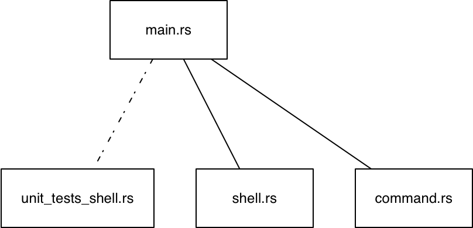
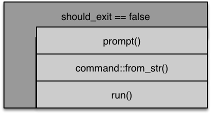

# README hw6-t2
- [Einleitung](#einleitung)
- [Implementierung](#implementierung)
    - [*Shell* Datenstruktur](#shell-datenstruktur)
        - [Public Methode *new()*](#public-methode-new)
        - [Public Methode *start() -> Result*](#public-methode-start---result)
        - [Private Methode *shell_loop() -> Result*](#private-methode-shellloop---result)
        - [Private Methode *prompt() -> Result<Option<String>, ...>*](#private-methode-prompt---resultoptionstring)
        - [Private Methode *run()*](#private-methode-run)
    - ['Command Datenstruktur'](#command-datenstruktur)
- [Externe Crates](#externe-crates)
- [Module und Tests](#module-und-tests)
- [Dokumentation](#dokumentation)

## Einleitung

In dieser Aufgabe werden Sie beginnen, eine einfache, aber robuste Shell zu erstellen. In den nächsten Aufgaben werden Sie diese Shell dann weiter ausbauen.

Dafür werden zu Beginn 2 Objekte (Structs) benötigt:

- Shell
- Command

Die Unit Tests dieser Objekte schreiben Sie bitte wieder in eigene Dateien, siehe folgendes Diagramm:



Die Methoden der Datenstruktur Shell beinhalten das Setup und die Loop einer Shell. In der Loop wird der Prompt ausgegeben und auf die Eingaben des Benutzers gewartet. Schließt der Benutzer seine Eingabe mit RETURN ab, so wertet eine Methode die Eingabezeile aus und erstellt daraus die vom Benutzer eingegeben Kommandos. Diese Loop kann der Benutzer mit dem Kommando `exit` beenden.

Das Handling der Kommandos übernehmen die Methoden der Datenstruktur Command. Beachten Sie, Ihre derzeitige Shell, mit der Sie selbst im Labor arbeiten (labshell), wird nicht einfach beendet wenn ein Kommando fehlerhaft ist oder nicht ausgeführt werden kann. Ebenso soll Ihre Shell nur bei dem Kommando `exit` beendet werden.

Die main() Funktion selbst hat somit wenig zu tun, sie muss lediglich eine Instanz des Datentyps Shell starten und das Ergebnis auswerten. Ist das Ergebnis 'Ok' so wird das Programm mit dem Exitcode 0 beendet. Tritt intern bei der Benutzung einer Funktionalität Ihrer Shell ein Fehler auf, welcher nicht von Ihnen behandelt werden kann, so wird die Shell mit dem Exitcode 1 beendet.

```Rust
...
let mut s = Shell::new(..);
    match s.start() {
        Ok(_) => process::exit(0),
        Err(_) => process::exit(1),
    }
...
```

## Implementierung

### *Shell* Datenstruktur

Die Datenstruktur 'Shell' hat folgende Felder:

```Rust
struct Shell<R, W> {
    pub reader: R,
    pub writer: W,
    pub should_exit: bool,
    pub name: String,
}
```

'reader' ist der Input Kanal Ihrer Shell und 'writer' der Output Kanal. Das Flag 'should_exit' signalisiert Ihrer Loop (siehe unten), dass die Loop beendet werden soll. 'name' ist der Name der Shell, den diese immer am Anfang des Prompts ausgibt, damit diese sich von Ihrer normalen Shell unterscheidet.

Für Ihre Implementierung verwenden Sie folgende Traitbounds:

- R: BufRead
- W: Write

Um das Verhalten einer echten Shell zu erhalten benötigen Sie für den Reader die Standard-Eingabe und für den Writer die Standard-Ausgabe.

In den Unit Tests werden andere Typen für R und W benutzt. Schauen Sie sich dazu die Tests in `unit_tests_shell.rs` an. Diese sollen Ihnen als Beispiel für eigene Tests dienen.

#### Public Methode *new()*

```Rust
pub fn new(input: R, output: W, name: String) -> Self
```

Eine Instanz der Shell wird erstellt.

#### Public Methode *start() -> Result*

Die public Methode *start()* ruft die private Methode *shell_loop()* auf. Die Funktion *start()* ist für evtl. spätere Erweiterungen gedacht, wenn in der Shell vor dem Starten der Loop noch weitere Initialisierungsarbeiten durchzuführen sind.

#### Private Methode *shell_loop() -> Result*

Die Basis Loop einer Shell haben wir bereits in der Vorlesung besprochen. Die Loop wartet auf Eingaben des Benutzers, die dieser mit RETURN abschließt. Die Eingaben werden dann ausgewertet und das Kommando, das sich u.U. daraus ergibt ausgeführt. Danach steht die Loop wieder für Eingaben bereit.



#### Public Methode *prompt() -> Result<Option<String>, ...>*

Die Funktion gibt den Namen der Shell, den aktuellen Pfad (siehe `std::env`) sowie das ' >' Zeichen, gefolgt von einem Leerzeichen aus:

```text
bsys-shell /Users/username >
```

Nach der Ausgabe wartet die Funktion auf Eingaben des Benutzers.

Benutzen Sie zum Einlesen die *read_line()* Funktion. Liefert *read_line()* kein Zeichen, so gibt die Funktion None zurück. Werden Zeichen von *read_line()* eingelesen, so liefert die Funktion die Eingabe des Benutzers zurück.

> Damit bei einem *write!()* Aufruf auf der Konsole auch der String erscheint, muss nach dem *write!()* Aufruf ein *flush()* Aufruf folgen

Wie am Funktionskopf zu erkennen ist, liefert diese Funktion im Erfolgsfall den eingelesenen String zurück.

#### Private Methode *run()*

Diese Methode wird von *shell_loop()* aufgerufen, wenn der Benutzer Eingaben gemacht hat, und daraus ein Kommando geparst werden konnte. Das eigentliche Parsen des Strings geschieht im 'Command' Modul. Das Modul liefert nach einem erfolgreichen Parse-Vorgang ein Kommando zurück, welches dann in run() aufgerufen wird.

Sowohl die Funktion zum Parsen des Strings, als auch die Methoden um die eigentlichen Kommandos auszuführen, platzieren Sie bitte in die Datei `command.rs`.

### 'Command Datenstruktur'

Die Datenstruktur 'Command' in `command.rs` hat zunächst folgende Felder:

```Rust
enum Command {
    Empty,
    Exit,
    Cd(Option<OsString>),
}
```

Die Kommandos bedeuten:

- 'Empty': Keine Eingabe, z.B. hat der Benutzer nur Return, Leerzeichen oder andere Whitespaces getippt.
- 'Exit': Dieses Kommando bedeutet, dass sich die Shell vor dem Start der nächsten Loop beendet.
- 'Cd': ein Change Directory Befehl soll ausgeführt werden. *Option* enthält den Pfad zu welchem gewechselt werden soll.


Im Modul `command.rs` wird die Trait Methode `FromStr` bereit gestellt, so dass das Objekt Command dieses Trait unterstützt.

```Rust
...
fn from_str(s: &str) -> Result<Command, .....> {
```

Diese Funktion können Sie benutzen, um sich den Input des Users in der Shell analysieren zu lassen. Als Rückgabewert erhalten Sie den entsprechenden `Command`. Somit können Sie im Modul `shell.rs` komfortabel über folgenden Aufruf den Input String in ein Kommando wandeln lassen:

```Rust
Command::from_str(&line).and_then(|cmd| self.run(cmd))
```

In der obigen Trait Methode können die einfachen Kommandos wie:

- Empty und
- Exit

direkt - je nach Input des User - zurück gegeben werden. Für komplexere Funktionen wie **cd** bietet es sich an, in der Trait Methode spezifische Methoden des Datentyps Command aufzurufen. Für jedes Kommando sind in der command.rs zwei Methoden zu implementieren:

- *parse_<command>()*
- *exec_<command>()*

Für das **cd** Kommando somit:

- *parse_cd()*
- *exec_cd()*

Die *parse_command()* Methode wird im *from_str()* Trait aufgerufen. Die *exec_<commnad>()>* Methode wird aus dem shell Modul an geeigneter Stelle aufgerufen.

> Ihr **cd** Kommando sollte sich so verhalten wie das **cd** Kommando der labshell. Somit kommen Sie beim Aufruf von **cd** ohne Parameter in Ihr Home Verzeichnis (siehe env::var_os("HOME")). Mit **cd ..** in das Verzeichnis 'darüber' usw.


## Externe Crates

Benutzen Sie für Ihre Implementierung nur die externe Crate `nix`.

## Module und Tests

Ob und wie Sie den Code in weitere Module aufteilen wollen ist Ihnen überlassen. Schreiben Sie jedoch Ihre Unit-Tests in der Datei `unit_test_shell.rs` oder als eigenständigen Test, der von 'cargo test' aufgerufen wird, siehe auch [Testing][]. Einfache Tests können auch direkt in die Dokumentation 'codiert' werden, siehe [Documentation Tests][].

Wichtig: Erstellen Sie ausreichend Unit Tests, um möglichst alle Methoden aus `shell.rs` und `command.rs` ausreichend testen zu können.

## Dokumentation

Bei dieser Aufgabe ist Ihre Dokumentation wichtig, um Ihren Programmablauf nachvollziehen zu können. Bitte dokumentieren Sie Ihre Funktionen entsprechend umfangreicher und kommentieren Sie spezielle Kniffe im Code, die Sie verwendet haben.

[Testing]: https://doc.rust-lang.org/book/first-edition/testing.html
[Documentation Tests]: https://doc.rust-lang.org/book/first-edition/testing.html#documentation-tests
