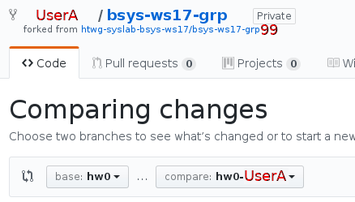

# HW0 - gittask0

## Vorbereitung

### User A @ Container
```bash
cd ~/src/htwg-syslab-bsys-ws17/bsys-ws17-grpN
git status # verify that the branch is hw0-UserA
```

### User B @ Container
```bash
cd ~/src/htwg-syslab-bsys-ws17/bsys-ws17-grpN
git status # verify that the branch is hw0-UserB
```

## Konflikterzeugung
Beide Benutzer verändern auf ihrer lokalen Kopie eine Datei und laden diese Änderung hoch.
Beim zusammenführen fällt der Konflikt dann auf, und muss von einem Benutzer behoben werden.

### User A @ Container
* Ersetze die beiden Fragezeichen in der Tabelle mit jeweils Namen und Github Benutzernamen.
* Ersetze das N in der Überschrift durch die Gruppennummer

```bash
git commit -v SOLUTION.md
git push
```

### User A @ GitHub
* Erstelle einen Pull-Request von _hw0-UserA_ auf _hw0_.

    

### User B @ Container
* Ersetze die beiden Fragezeichen in der Tabelle mit jeweils Namen und Github Benutzernamen.
* Ersetze das N in der Überschrift durch die Gruppennummer

```bash
git commit -v SOLUTION.md
git push
```

### User B @ GitHub
* Bestätige den Pull-Request von User A
* Erstelle einen Pull-Request von _hw0-UserB_ auf _hw0_.

    
* **Konflikt tritt auf!**

## Konfliktbehandlung

### User B @ Container
* Bestätige den Pull-Request von User A
* Erstelle einen Pull-Request von _hw0-UserB_ auf _hw0_.
  **Konflikt tritt auf!**

### User B @ Container
```bash
git checkout hw0
git pull
git checkout hw0-UserB
git merge hw0
# edit SOLUTIONS.md
git commit -v SOLUTIONS.md
git push
```

### User A @ GitHub
* Bestätige den Pull-Request von User B

### User A @ Container
```bash
git checkout hw0
git pull
```

## Abgabe

### User A @ GitHub
* Öffne Upstream Repository und erstelle Pull-Request von der _hw0_ von UserA's fork auf _master_ Branch des Upstream Repository
